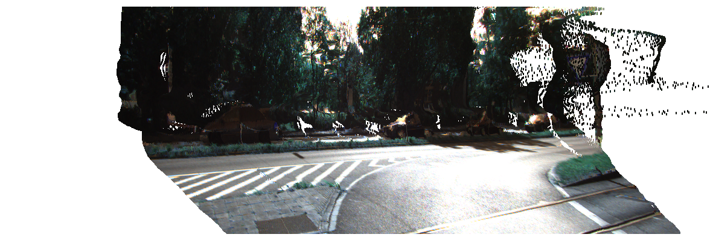

# 3D Reconstruction

## Introduction
  This directory contains cides to generate 3D models(Json file), showing rotating obejcts on the screen 
  by using rbg image and depth information, which is generated by stereo matching(see other directory 
  for more details). You can play with the codes and instrucitons below.

## Generate model file 
You can generate the model file in Json format, containg the coordinaion and color for each points,
by using the rgb image and the depth imofrmation.
If you want to gemerate the model, you can use:

```
python3 create_RGB_model.py --rgb <path to RGB image> --depth <path to corresponding depth information>
```

## Check model information
To check the value stored in the model file, you can modify test() function in create_RGB_model.py
and use:

```
python3 create_RGB_model.py --mode test --load <path to model file> 
```

## Show the rotating object
To show the object rotating on the screen, you need a RGB image and corresponding depth information.
you can use:

```
python3 show.py --rgb <path to RGB image>  --depth <path to corresponding depth information>
```

> note: depth inofrmation is generated by stereo matching, which can only be .pfm or .npy for now.

> note: the RGB image and deth inforamtion file must have same width and height.

### original 2D image


### 3D model

