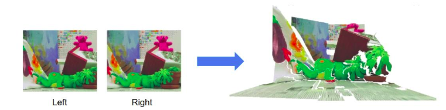
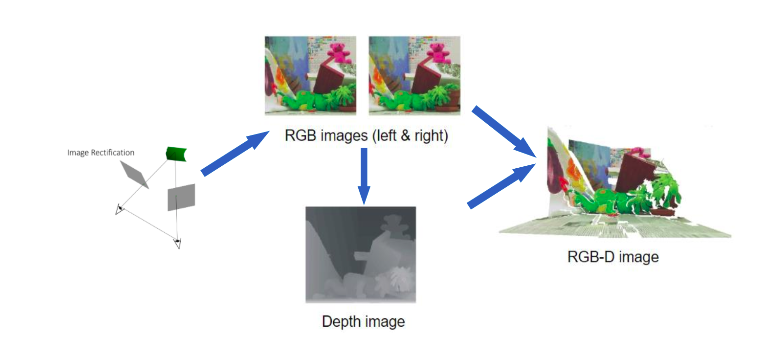

# 3D Reconstruction From Stereo Matching
NTU CSIE ICG 2019 Fall final project

## Introduction
 In this project, we want to reconstruct 3D model from 2 RGB images, which are taken from left and right respectively, and show the result on a window, even on the website.

## Pipeline
1. Take left and right images
2. Predict depth information from these 2 images by **Stereo Matching**
3. Reconstruct 3D models from RGB image and depth imformation
4. Shoe the 3D model on a window or a website

## How to read this repo
* stereo_matching/ : files to be use in the begining of the pipeline
* 3d_reconstruction/ : files to build 3D model 
* app/ & server/ : show the result on the website

If you are interested, you can also watch out final presentation slides and report in this repo.
have fun with this !
